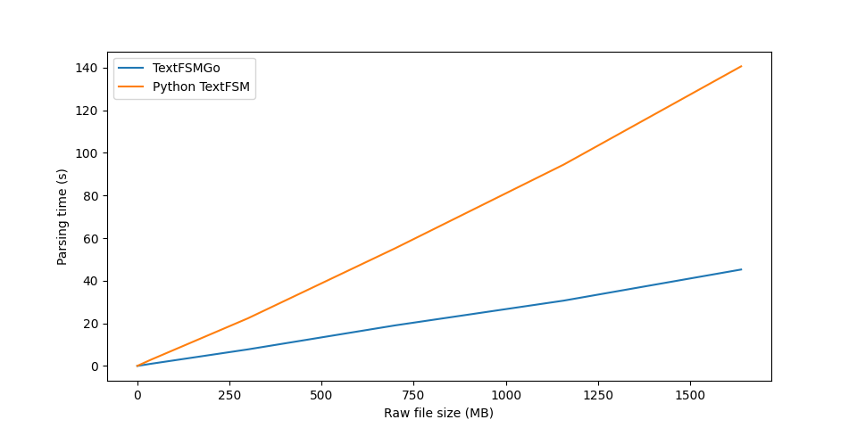

# TextFSMGo

TextFSMGo is just another but **[faster](#performance)** implementation of [Google TextFSM](https://github.com/google/textfsm), a template-based state machine for parsing semi-formatted text.

TextFSMGo is compatible with the existing TextFSM template (with some [caveats](#caveats)): to write a template file check the [original project documentation](https://github.com/google/textfsm/wiki/TextFSM).

## Build and install

To build and install TextFSMGo is it possible to leverage the Makefile recipe.

To build the project from the root directory of this repository run the command:

```shell
make build
```

it will build and store the executable in the `./dist` directory of the repo.

To build and install TextFSMGo launch the command:

```shell
make install
```

## Usage

### Using the CLI tool

TextFSMGo provides a CLI tool allowing to parse some raw text using a textfsm template and producing
a json output.

For example the following command parse the `ip_cmd.raw` file via the `ip_cmd.textfsm` template and prints
the result in json format:

```shell
textfsmgo ./examples/data/ip_cmd.raw ./examples/data/ip_cmd.textfsm
```

The `-o` argument can be used to write the output to a local file:

```shell
textfsmgo -o result.json ./examples/data/ip_cmd.raw ./examples/data/ip_cmd.textfsm
```

It is possible to indent the json output by providing the `-i` argument.

### Using the library

To use TextFSMGo declare it as dependency of your project

```shell
go get github.com/claudiolor/textfsmgo
```

To use TextFSMGo the first thing to do is writing the template for the semi-formatted text to parse.
Then it will be possible to create a state machine starting from a template file:

```golang
tmpl_file := "/path/to/template.textfsm"
text_to_parse := "..."
parser, err := textfsmgo.NewTextFSMParser(tmpl_file)
if err != nil {
    handleError(err)
}

res, err := parser.ParseTextToDicts(text_to_parse)
if err != nil {
    handleError(err, 1)
}
```

The `parser.ParseTextToDicts()` returns a slice of map having `string` as keys and `interface{}` as
value, which could be a string or a slice of strings.

#### Handling the result

Let's imagine we would like to manager the [result of the template to parse the command](./examples/data/ip_cmd.textfsm) `ip a`, it might be possible to build a struct where to store each entry:

```golang
type NetworkIf struct {
    ifname string
    macaddr string
    addresses []string
    mtu int
    state string
}

...
func main(){
    ...
    // Parse the text with TextFSMGo
    res, err := parser.ParseTextToDicts(text_to_parse)
    if err != nil {
        handleError(err, 1)
    }

    // Store the content of the Map into a slice of structs
    addresses_list := []NetworkIf{}
    for _, entry := range res {
        mtu, _ := strconv.Atoi(entry["mtu"].(string))
        addresses_list = append(
            addresses_list,
            NetworkIf{
                ifname:    entry["ifname"].(string),
                macaddr:   entry["macaddr"].(string),
                addresses: entry["addresses"].([]string),
                state:     entry["state"].(string),
                mtu:       mtu,
            },
        )
    }
}
```

##### JSON encoding

TextFSMGo provides an utility function that allows to encode the result in json `ConvertResToJson(map_res *[]map[string]interface{}, indent bool)`:

```golang
import "github.com/claudiolor/textfsmgo/pkg/textfsmg"

...

func main(){
    ...
    intend = false
    // Parse the text with TextFSMGo
    res, err := parser.ParseTextToDicts(text_to_parse)
    if err != nil {
        handleError(err, 1)
    }
    ...
    jsonRes, err := utils.ConvertResToJson(&res, intend)
}
```

[A complete example](./examples/example.go) can be found in the examples directory.

## Performance

TextFSMGo, also due to the used programming language, guarantes a good level of performance.
Some tests were performed parsing some raw data and encoding it in json. The tests were repeated increasing the size of the raw data.
On average **TextFSMGo was the 70% faster than the original Python implementation**:



*Tests were performed using a laptop with i5-1145G7 and 32GB of ram*


## Caveats

---

:warning: **Warning**: I wrote TextFSMGo just for fun and to practice with Golang, so please consider it as is.

---

At the moment TextFSMGo has the following caveats:

- Named match groups in values definition are currently not supported, so values cannot contain dictionaries;
- Perl syntax of regex is not supported.
